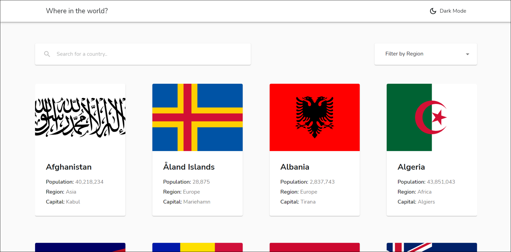
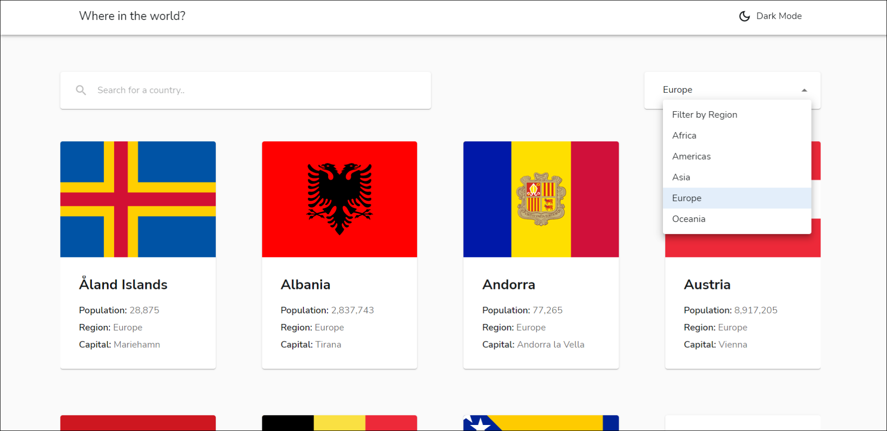
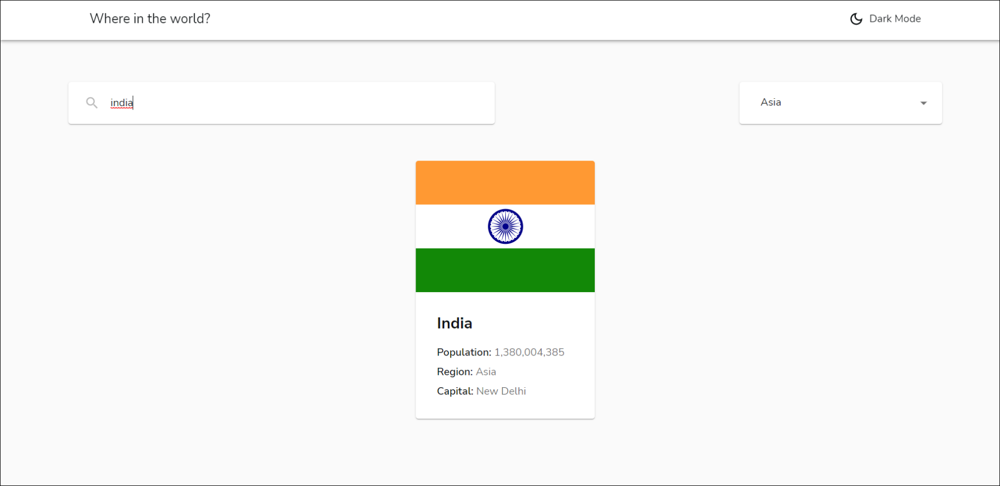
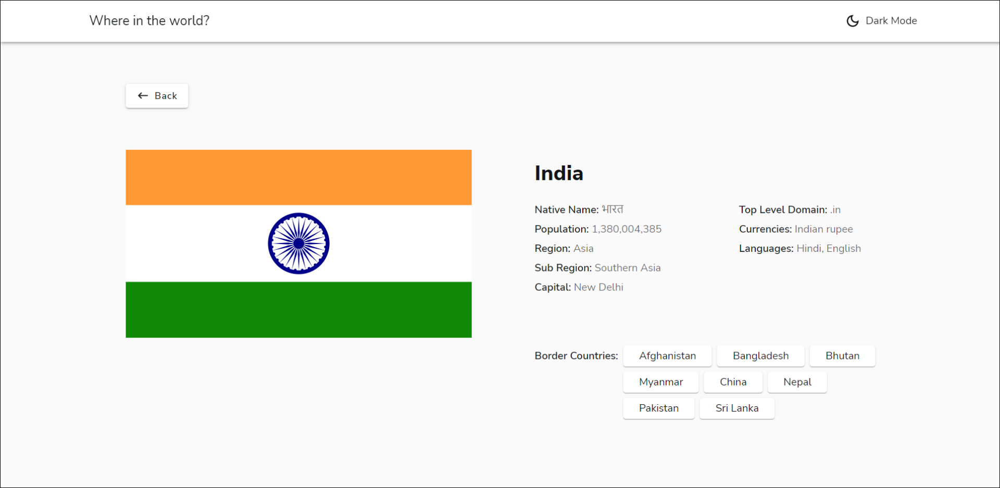
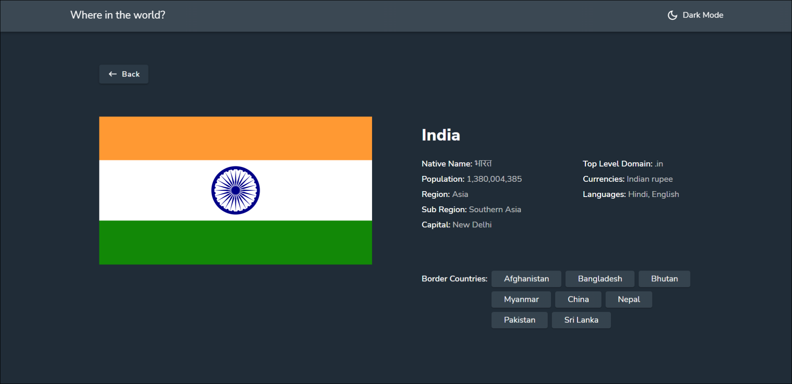

# Where in the world

A country search app built using Next.js and Material UI.
This is a solution to the [REST Countries API with color theme switcher challenge on Frontend Mentor](https://www.frontendmentor.io/challenges/rest-countries-api-with-color-theme-switcher-5cacc469fec04111f7b848ca)
 
 

### All countries

 
 

### Filter by region

 
 

### Search for countries

 
 

### Country details

 
 

### Dark mode

